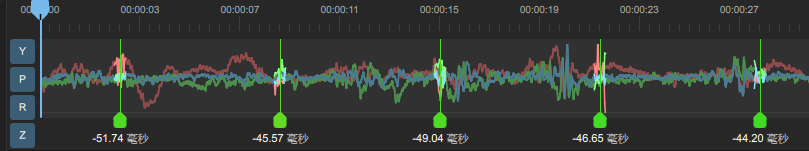
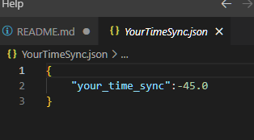
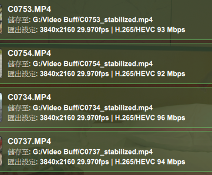

# GyroflowFastTimeSymc
Applicable for GyroFlow version: `1.5.0`
# 使用方式
If you are using the same device for gyro calibration, the time difference should be the same. Therefore, after performing the initial calibration, record the current time difference and fill it in the `YourTimeSync.json` file.

After exporting the `.gyroflow file`, run `add_time_sync.py`.

Drag and drop the output `*._add_time_sync.gyroflow` file into GyroFlow.
